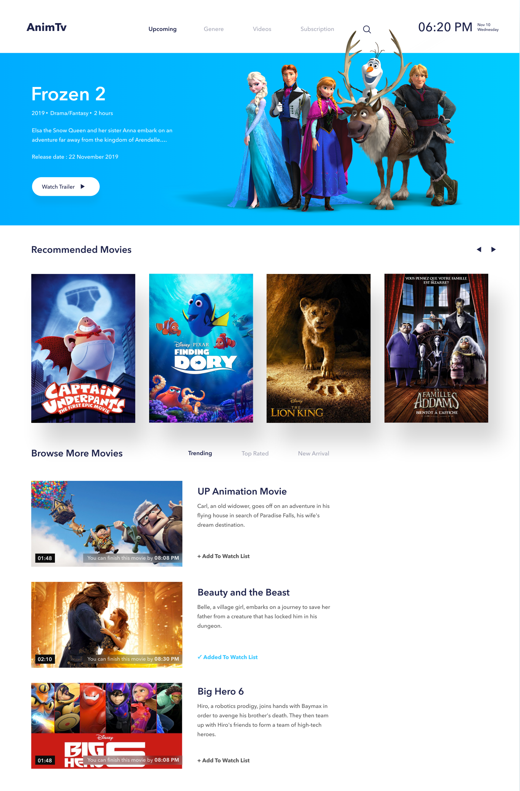

# Вёрстка по макету Sketch [HTML, SCSS, JS, Gulp]

Адаптив делал по своему усмотрению
Все скрипты (слайдер с функцией свайпа, переключение табов и т.д.) написаны на чистом JS

[Ссылка на макет](https://inspect.ceros.com/view/283d9e2b658f44c5b1e6e30aa0cb95e0/90767180/inspect/)

 
